# PEMROGRAMAN BERORIENTASI OBJEK

## Biodata

- **Nama** : Ridho Sachlan
- **NIM** : 4525210066
- **Program Studi** : Teknik Informatika - A
- **Mata Kuliah** : Pemrograman Berorientasi Objek
- **Dosen Pengampu** : Adi Wahyu Pribadi, S.Si., M.Kom

## Teknologi yang Digunakan

Seluruh tugas dikerjakan dengan dua bahasa pemrograman:

- **Java**, dijalankan menggunakan Java Development Kit (JDK).
- **PHP**, dijalankan menggunakan PHP interpreter.

## Materi Pembelajaran

Repository ini memuat latihan konsep pemrograman berorientasi objek dari
pertemuan 01 sampai 06:

1. Class dan Object
2. Encapsulation dan Constructor
3. Inheritance dan Method Overriding
4. Polimorfisme
5. Asosiasi, Agregasi, dan Komposisi
6. Abstract Class dan Interface

Tiap pertemuan memiliki dua versi program, yaitu Java dan PHP, yang
menghasilkan output setara. Versi PHP merupakan hasil konversi dari kode Java.

---

## Tugas 01 - Class dan Object

### Deskripsi Tugas

Class `iPhone` dipakai sebagai template untuk membentuk object. Atribut
`color` dan `storage` diisi lewat constructor. Pada program utama dibuat dua
object, yaitu iPhone 13 (Red, 128GB) dan iPhone 14 (Grey, 256GB). Data
masing-masing object kemudian dicetak dengan memanggil `getColor()` dan
`getStorage()`.

### Screenshot Hasil Run

#### Hasil Run Java

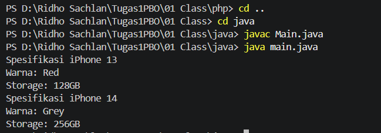

#### Hasil Run PHP

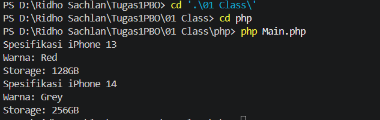

---

## Tugas 02 - Encapsulation dan Constructor

### Deskripsi Tugas

Class `Mahasiswa` menyembunyikan atribut `nama`, `nim`, dan `umur` dengan
modifier `private`. Data hanya bisa dibaca dan diubah melalui method getter
dan setter. Class ini juga menyediakan dua cara pembuatan object: tanpa
argumen (nilai awal "Belum Diisi" dan umur 0) serta dengan argumen lengkap.
Pada PHP, kedua bentuk constructor tersebut digabung menjadi satu constructor
berparameter opsional. Method `tampilkanInfo()` dipakai untuk mencetak seluruh
data mahasiswa, dan pengujiannya dilakukan di file `Aplikasi`.

### Screenshot Hasil Run

#### Hasil Run Java

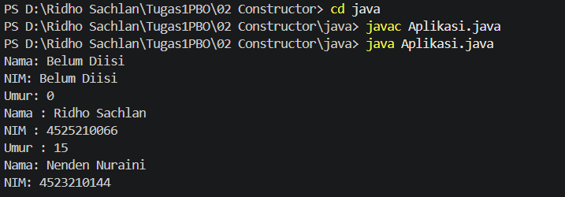

#### Hasil Run PHP

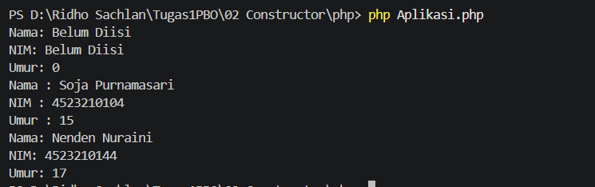

---

## Tugas 03 - Inheritance dan Method Overriding

### Deskripsi Tugas

Pertemuan ini berisi dua contoh pewarisan. Contoh pertama adalah class
`BangunDatar` sebagai parent dengan method `luas()` dan `keliling()`. Class
`Lingkaran`, `Persegi`, dan `Segitiga` mewarisinya lalu menimpa (override)
method tersebut dengan rumus masing-masing. `Segitiga` hanya meng-override
`luas()`, sehingga pemanggilan `keliling()` memakai versi milik parent.

Contoh kedua adalah `MahasiswaInternational` yang mewarisi `Mahasiswa` dan
menambahkan atribut `negaraAsal`. Constructor-nya meneruskan data ke parent,
dan method `tampilkanInfo()` di-override agar ikut menampilkan negara asal.

### Screenshot Hasil Run

#### Hasil Run Java

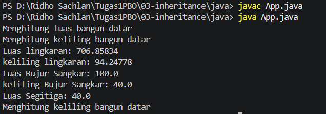

#### Hasil Run PHP

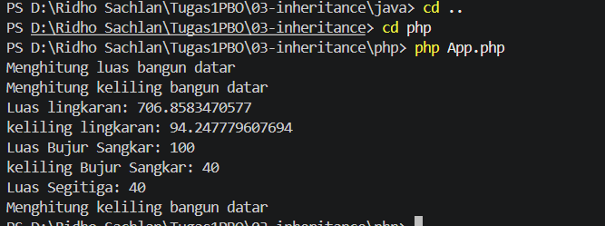

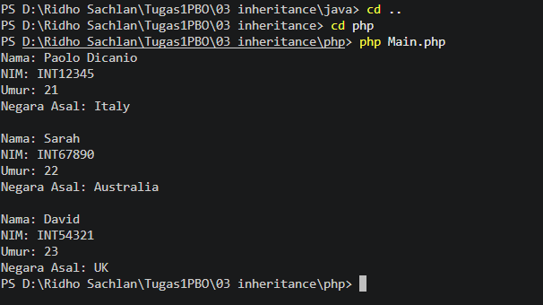

---

## Tugas 04 - Inheritance dan Polimorfisme

### Deskripsi Tugas

Class `Handphone` menjadi parent dengan atribut `merk` dan `model` serta
method `nyalakan()`, `matikan()`, dan `telepon()`. Class `Smartphone` dan
`FeaturePhone` mewarisinya dan mengganti perilaku ketiga method itu, misalnya
smartphone melakukan panggilan video sedangkan feature phone melakukan
panggilan suara. Keduanya memiliki method tambahan sendiri, yaitu
`aksesInternet()` pada `Smartphone` dan `mainGameSnake()` pada `FeaturePhone`.

Kedua jenis object dimasukkan ke dalam satu daftar `Handphone`, lalu dipanggil
dengan method yang sama dalam perulangan. Hasilnya berbeda sesuai tipe
objectnya, dan pengecekan tipe dilakukan sebelum method khusus dijalankan.

### Screenshot Hasil Run

#### Hasil Run Java

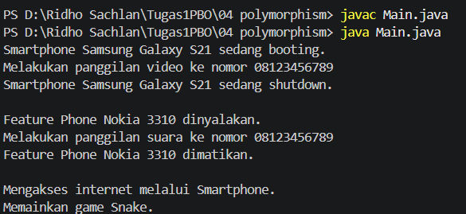

#### Hasil Run PHP

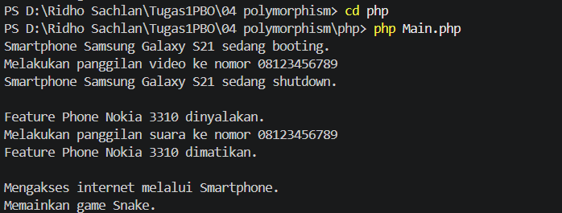

---

## Tugas 05 - Asosiasi, Agregasi, dan Komposisi

### Deskripsi Tugas

Program ini memperlihatkan tiga bentuk hubungan antar-object:

- **Asosiasi**: `Dokter` merawat `Pasien` melalui method `merawat()`. Kedua
  object dibuat sendiri-sendiri dan hanya saling berinteraksi.
- **Agregasi**: `Tim` menerima kumpulan object `Pemain` dari luar lewat
  constructor. Pemain tetap ada walaupun tim tidak ada.
- **Komposisi**: `Buku` membuat object `Bab` (Pendahuluan, Isi, Penutup)
  sendiri di dalam class-nya. Bab hanya hidup sebagai bagian dari buku.

### Screenshot Hasil Run

#### Hasil Run Java

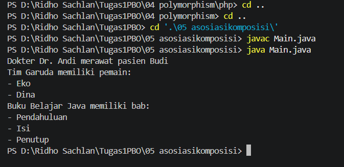

#### Hasil Run PHP

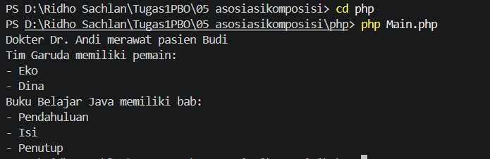

---

## Tugas 06 - Abstract Class dan Interface

### Deskripsi Tugas

`Vehicle` adalah abstract class yang menyimpan nama kendaraan dan method
`showInfo()`. Class `Car`, `Motor`, `Boat`, dan `Building` merupakan turunan
dari `Vehicle`. Dua interface mengatur kemampuan tambahan: `Movable` dengan
method `move()` dan `Fuelable` dengan method `refuel()`.

`Car`, `Motor`, dan `Boat` mengimplementasikan kedua interface dengan cara
masing-masing. `Building` tidak mengimplementasikan keduanya, jadi hanya
dapat menampilkan informasi dari `Vehicle`.

### Screenshot Hasil Run

#### Hasil Run Java

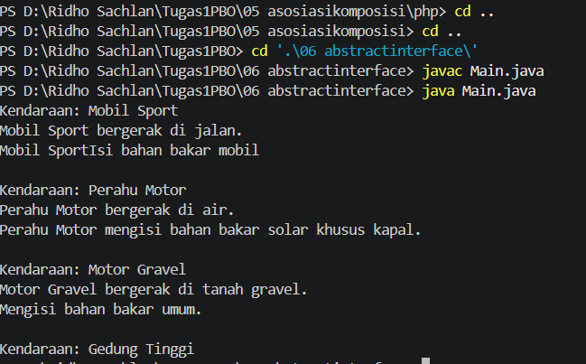

#### Hasil Run PHP

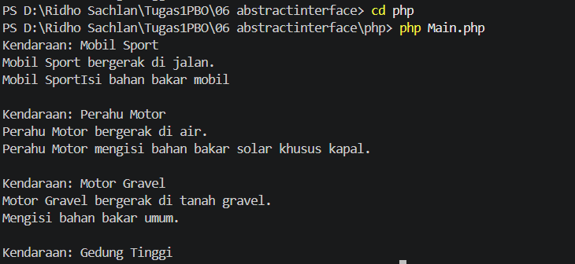
